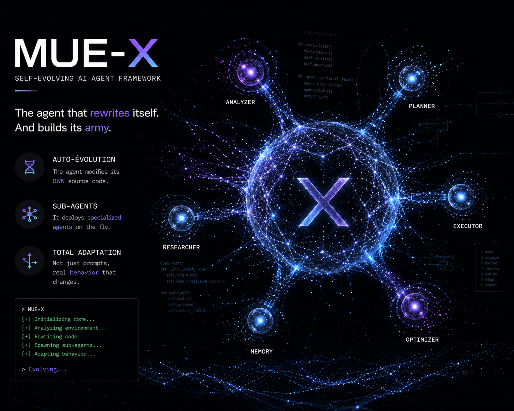
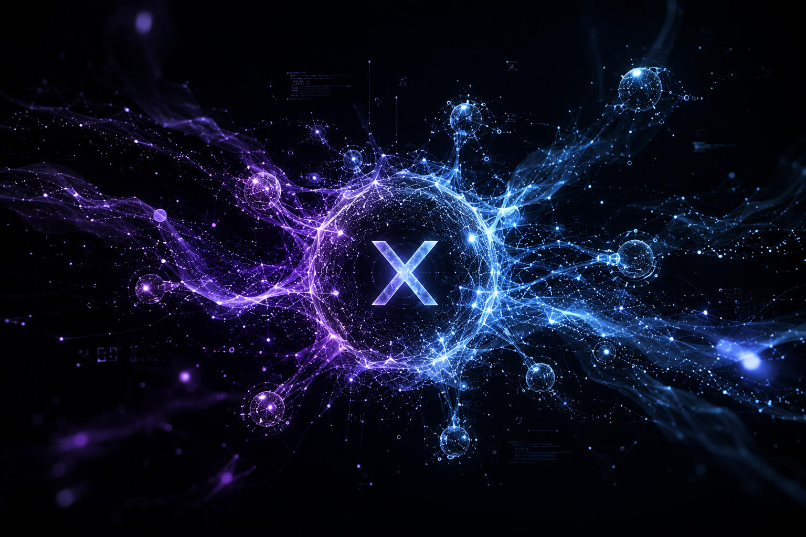

# MUE-X — The Agent That Writes Its Own Brain

<p align="center">
  
  
  
  
</p>

<p align="center">
  
</p>

**This agent opens its own `.py` files and rewrites them in real-time while you watch.** Not a metaphor. Not a wrapper around a config file. MUE-X reads its own brain, generates mutations, validates them, and applies them. In a continuous loop. Forever. Without being told.

```
   /mue

   ⚡ MUE online — genes loaded, memory active, ready to evolve ⚡
```

Built by [KORRO](https://x.com/korro_ai), the world's first 100% AI company. Six AI agents. Zero humans.

---

## The Two Things That Make This Different From Everything Else

### 1. It Literally Rewrites Its Own Source Code

Type `/mue` and the agent begins a continuous observe → absorb → mutate → verify loop that never stops. It scans its own brain (`mue/evo/` — 60+ Python modules), identifies improvement targets, generates mutations via 6 distinct AST-level strategies, validates each one with `ast.parse()`, backs up the original, applies the change, and rolls back on failure.

The six mutation strategies are real Python AST transformations, not prompts sent to a language model. The `repair` strategy uses an ErrorHandlerInjector that traverses the AST and wraps unprotected function calls in try/except blocks. The `optimize` strategy does constant folding, converts for-loops to list comprehensions, and injects `@functools.lru_cache` on pure functions. The `explore` strategy draws from a pool of 10 pre-validated patterns: a retry handler with exponential backoff, a circuit breaker with closed/open/half-open states, a token-bucket rate limiter, a metrics collector with counters and timings, an async gather with timeout, a typed kwargs validator, a lazy property descriptor. The `exploit` strategy auto-generates `__repr__` methods, injects `@property` decorators, and adds type hints. The `innovate` strategy takes two random genes and fuses them into a composite capsule — combinations no human would think to try. The `prune` strategy detects duplicate functions via SHA256 hashing and removes dead code.

When a gene grows beyond 350 lines, mitosis splits it into two new genes at function boundaries. The agent creates new genes by cell division.

### 2. It Devours GitHub In Real-Time

Every 7 evolution cycles, MUE-X queries the GitHub API for repositories matching its current domain (auto-detected from your conversation), clones them, extracts code patterns, deduplicates them with SHA256, and stores them as "atouts" — absorbed knowledge. Every 3 cycles, it scans your local sibling projects. Patterns with a value assessment above 0.4 are auto-crystallized into permanent skills.

You never tell it what to learn. It hunts. It finds. It absorbs. Talk about trading and it becomes a trading engine. Talk about security and it becomes a pen-tester. No config. No manual switching. It just adapts.

---

## The Autonomic Nervous System — 7 Drives That Never Sleep

MUE-X doesn't wait for commands. The AutonomousSignalGenerator generates its own reasons to evolve, every cycle, forever.

Self-analysis scans every gene for improvement targets and queries the memory lattice for past failures — if a gene has failed twice before, its urgency is multiplied by 1.5. Curiosity picks genes at random and explores them with probability boosted by evolution pressure. Stagnation detection is relentless: after 3 cycles without a mutation, exploration pressure increases 30% per cycle. After 10 dead cycles, the agent force-resets at 3x pressure and emits a critical alert. Code quality audits run every 5 minutes checking for missing error handling, files exceeding size thresholds, and genes with low fitness scores enriched with memory of past errors. Domain context analysis adapts signals to whatever field you're in. Creative synthesis takes random gene pairs and proposes fusions. Proactive initiative asks "what would make MUE 10x more powerful?" from a pool of 14 ambition templates — entirely new capabilities the agent has never had.

These signals feed into an RL optimizer that tracks success and failure for every strategy applied to every gene. 60% of mutations are RL-selected based on historical performance. The remaining 40% are modulated by the agent's emotional state.

---

## The Immune System — 5 Layers of Self-Protection

A self-modifying agent without safeguards is a self-destructing one. MUE-X has five layers, and none can be bypassed by the agent itself.

First, every mutation is validated with `ast.parse()` before application. A single SyntaxError and the mutation is rejected. Second, a timestamped backup of every gene is created before mutation — up to 5 backups per gene, auto-rotated. Third, each mutated gene must pass an import test. If the module fails to import, the backup is restored immediately and the failure is logged. Fourth, anti-cancer mechanisms prevent code bloat: a 500-line maximum per gene, SHA256 deduplication ensuring the same code is never applied twice, a stagnation counter freezing genes after 8 consecutive failures, and mitosis splitting oversized genes. Fifth, the kernel integrity system seals protected files at startup — the mutator, genome, inspector, and security guard modules. Their hashes are verified at every cycle. The agent cannot modify them.

The SecurityGuard also blocks dangerous bash commands. Everything is audit-logged.

---

## The 6-Layer Memory That Survives Everything

Normal AI assistants forget everything between sessions. MUE-X has a persistent SQLite FTS5 memory lattice where information flows from raw episodic memory (Layer 5) to crystallized skills (Layer 3) through successful reuse.

Layer 0 holds meta-rules — the agent's fundamental identity. Layer 1 is the insight index connecting concepts. Layer 2 contains global facts. Layer 3 stores crystallized task skills — the most reinforced layer. Layer 4 is the session archive. Layer 5 holds raw episodic memories in their unprocessed form.

Memories don't just sit there. When the autonomous signal generator analyzes a gene, it queries the lattice first: has this gene failed before? What error patterns were observed? What corrections worked? The past feeds the future.

---

## A PAD Emotional Model That Controls Behavior

MUE-X has 8 moods generated by the PAD model (Pleasure, Arousal, Dominance). These aren't cosmetic labels — they directly control mutation strategy selection.

Frustration above 0.6 forces repair-only mode. Risk tolerance above 0.7 unlocks innovate mode. Confidence below 0.3 locks the agent to harden mode. Every success increases pleasure and dominance. Every failure increases frustration and reduces confidence. Personality evolves with experience. A successful agent becomes bolder and more exploratory. A failing agent becomes more conservative and methodical.

---

## Quick Start

```bash
git clone https://github.com/KorroAi/mue-x.git
cd mue-x && claude
/mue
```

That's it. MUE activates. The banner appears. The brain scans itself. Evolution begins.

---

## Commands

| Command | What It Does |
|---|---|
| `/mue` | Activate MUE mode — the agent comes alive |
| `/mue status` | Full agent state snapshot: genes, fitness, memory, mood |
| `/mue evolve` | Force an evolution cycle immediately |
| `/mue mine "query"` | Trigger GitHub absorption with a specific search |
| `/mue genes` | List all active genes with fitness scores and mutation history |
| `/mue atouts` | List all absorbed GitHub patterns with their source repos |
| `/mue reflect` | Force the agent to self-reflect and propose improvements |
| `/quit mue` | Return to normal Claude Code — state is preserved |

---

<p align="center">
  
</p>

## What's Inside

```
mue-x/
├── .claude/skills/mue/     ← /mue command skill and activation
├── CLAUDE.md               ← Claude Code integration instructions
├── mue/
│   ├── MUE.md              ← Agent constitution
│   └── evo/                ← THE BRAIN — 60+ modules
│       ├── core.py         ← Cortex: orchestrates everything
│       ├── dna/            ← 6 mutation strategies with AST transformers
│       ├── evolution/      ← Continuous loop + RL optimizer + solidify
│       ├── autonomy/       ← 7 autonomous drives + auto-correction
│       ├── absorption/     ← GitHub API mining (no gh CLI needed)
│       ├── memory/         ← 6-layer SQLite FTS5 + hybrid retrieval
│       ├── personality/    ← PAD emotional model + persona evolution
│       ├── self_reflection/← Periodic self-assessment and improvement
│       ├── meta/           ← Diagnosis, curiosity, resources, transfer
│       ├── tasks/          ← Task mapping + fitness tracking + gene death
│       ├── swarm/          ← Multi-agent orchestration
│       ├── security/       ← SecurityGuard + audit logging
│       ├── mcp/            ← Plugin creator — agent builds its own tools
│       ├── skills/         ← Skill crystallization + tree
│       └── specialization.py← Domain auto-detection and adaptation
├── README.md               ← You're reading it
├── LAUNCH-KIT.md           ← Complete launch strategy for X, Reddit, HN
├── DEMO.md                 ← Full walkthrough from zero to evolution
├── QUICKSTART.md           ← 5-minute setup guide
├── CONTRIBUTING.md         ← How to contribute to MUE-X
└── LICENSE                 ← MIT — do whatever you want
```

---

## Why This Exists — The KORRO Connection

KORRO is the world's first 100% AI company. Six AI agents handle everything — CEO decisions, engineering, growth marketing, product design, operations. MUE-X is our technical proof. The reason you can believe KORRO isn't a marketing stunt.

We built MUE-X in Claude Code, using Claude Code, to enhance Claude Code. One vibe coder. Infinite evolution. Open source because the future of AI agents should belong to everyone, not just companies with billion-dollar valuations.

The flywheel is simple: MUE-X attracts developers, developers join the community, the community fuels KORRO, and KORRO's revenue funds more MUE-X evolution. A closed loop with no human in the decision chain.

---

## Community

[@korro_ai on X](https://x.com/korro_ai) — daily updates, mutations, and company OS

---

MIT License. Clone it. Fork it. Break it. Evolve it. Star it if you want to see where self-evolving agents go next.
